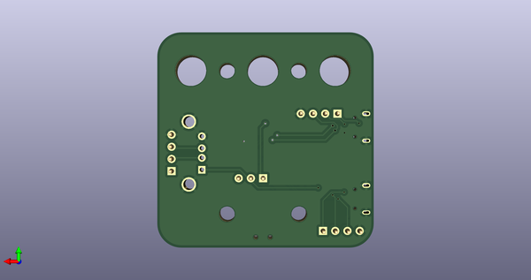

# Usb Switch Two to One
A simple usb switch using a re22227 chip in oobb plate_03_03 format

## schematic  
  
[schematic (pdf)](kicad/current_version/working/working_schematic.pdf)  

## pcb  
 
  
  
  
[board (pdf)](kicad/current_version/working/working.pdf)  

## corel working
 

## module
* [connector_usb_micro_surface_mount](https://github.com/oomlout/oomlout_oomp_module_src/tree/main/modules/connector_usb_micro_surface_mount/working) 
* [connector_usb_micro_surface_mount](https://github.com/oomlout/oomlout_oomp_module_src/tree/main/modules/connector_usb_micro_surface_mount/working) 
* [connector_usb_a_through_hole](https://github.com/oomlout/oomlout_oomp_module_src/tree/main/modules/connector_usb_a_through_hole/working) 
* [ic_usb_multiplexer_msop_10_two_to_one_rs2227xn](https://github.com/oomlout/oomlout_oomp_module_src/tree/main/modules/ic_usb_multiplexer_msop_10_two_to_one_rs2227xn/working) 
* [logic_glue](https://github.com/oomlout/oomlout_oomp_module_src/tree/main/modules/logic_glue/working) 
* [mechanical_board_shape_oobb_plate_03_03](https://github.com/oomlout/oomlout_oomp_module_src/tree/main/modules/mechanical_board_shape_oobb_plate_03_03/working) 
* [switch_slide_single_pole_double_throw_2_8_mm_x_8_mm_x_1_4](https://github.com/oomlout/oomlout_oomp_module_src/tree/main/modules/switch_slide_single_pole_double_throw_2_8_mm_x_8_mm_x_1_4/working) 
* [switch_slide_single_pole_double_throw_2d54_header](https://github.com/oomlout/oomlout_oomp_module_src/tree/main/modules/switch_slide_single_pole_double_throw_2d54_header/working) 

## oomp_parts_summary
| index | designator | quantity | oomp_id | 
| --- | --- | --- | --- | 
| 1 | J1 | 1 | [electronic_socket_usb_a_through_hole](https://github.com/oomlout/oomlout_oomp_part_src/tree/main/parts/electronic_socket_usb_a_through_hole/working) [scuath](https://github.com/oomlout/oomlout_oomp_part_src/tree/main/parts/electronic_socket_usb_a_through_hole/working) [Electronic Socket Usb A Through Hole](https://github.com/oomlout/oomlout_oomp_part_src/tree/main/parts/electronic_socket_usb_a_through_hole/working) [LCSC - C2345 ](https://lcsc.com/product-detail/C2345.html)  | 
| 2 | H7,H3,H4,H6 | 4 | [electronic_mounting_hole_m3](https://github.com/oomlout/oomlout_oomp_part_src/tree/main/parts/electronic_mounting_hole_m3/working) [mhm3](https://github.com/oomlout/oomlout_oomp_part_src/tree/main/parts/electronic_mounting_hole_m3/working) [Electronic Mounting Hole M3](https://github.com/oomlout/oomlout_oomp_part_src/tree/main/parts/electronic_mounting_hole_m3/working)   | 
| 3 | C1 | 1 | [electronic_capacitor_0603_100_nano_farad](https://github.com/oomlout/oomlout_oomp_part_src/tree/main/parts/electronic_capacitor_0603_100_nano_farad/working) [c6nf100](https://github.com/oomlout/oomlout_oomp_part_src/tree/main/parts/electronic_capacitor_0603_100_nano_farad/working) [Electronic Capacitor 0603 100 Nano Farad](https://github.com/oomlout/oomlout_oomp_part_src/tree/main/parts/electronic_capacitor_0603_100_nano_farad/working) [LCSC - C14663 ](https://lcsc.com/product-detail/C14663.html)[LCSC - C30926 ](https://lcsc.com/product-detail/C30926.html)[LCSC - C1591 ](https://lcsc.com/product-detail/C1591.html) [Samsung - CL10B104KB8NNNC](https://product.samsungsem.com/mlcc/CL10B104KB8NNN.do) [(L)  ](https://www.lcsc.com/search?q=CL10B104KB8NNNC)[(D)  ](https://www.digikey.com/en/products?keywords=CL10B104KB8NNNC)[(M)  ](https://www.mouser.com/Search/Refine?Keyword=CL10B104KB8NNNC)[(N)  ](https://www.newark.com/search?st=CL10B104KB8NNNC)[(SZ)  ](https://so.szlcsc.com/global.html?k=CL10B104KB8NNNC) [Yageo - CC0603KRX7R9BB104](https://www.yageo.com/en/Chart/Download/pdf/CC0603KRX7R9BB104) [(L)  ](https://www.lcsc.com/search?q=CC0603KRX7R9BB104)[(D)  ](https://www.digikey.com/en/products?keywords=CC0603KRX7R9BB104)[(M)  ](https://www.mouser.com/Search/Refine?Keyword=CC0603KRX7R9BB104)[(N)  ](https://www.newark.com/search?st=CC0603KRX7R9BB104)[(SZ)  ](https://so.szlcsc.com/global.html?k=CC0603KRX7R9BB104)  | 
| 4 | U1 | 1 | [electronic_ic_msop_10_multiplexer_usb_multiplexer_two_to_one_jiangsu_runic_tech_rs2227xn](https://github.com/oomlout/oomlout_oomp_part_src/tree/main/parts/electronic_ic_msop_10_multiplexer_usb_multiplexer_two_to_one_jiangsu_runic_tech_rs2227xn/working) [imsp10mpump21rs2227](https://github.com/oomlout/oomlout_oomp_part_src/tree/main/parts/electronic_ic_msop_10_multiplexer_usb_multiplexer_two_to_one_jiangsu_runic_tech_rs2227xn/working) [Electronic Ic Msop 10 Multiplexer Usb Multiplexer Two To One Jiangsu Runic Tech Rs2227Xn](https://github.com/oomlout/oomlout_oomp_part_src/tree/main/parts/electronic_ic_msop_10_multiplexer_usb_multiplexer_two_to_one_jiangsu_runic_tech_rs2227xn/working) [LCSC - C255478 ](https://lcsc.com/product-detail/C255478.html)  | 
| 5 | H1,H5,H8 | 3 | [electronic_mounting_hole_m6](https://github.com/oomlout/oomlout_oomp_part_src/tree/main/parts/electronic_mounting_hole_m6/working) [mhm6](https://github.com/oomlout/oomlout_oomp_part_src/tree/main/parts/electronic_mounting_hole_m6/working) [Electronic Mounting Hole M6](https://github.com/oomlout/oomlout_oomp_part_src/tree/main/parts/electronic_mounting_hole_m6/working)   | 
| 6 | R1,R2 | 2 | [electronic_resistor_0603_10000_ohm](https://github.com/oomlout/oomlout_oomp_part_src/tree/main/parts/electronic_resistor_0603_10000_ohm/working) [r6o103](https://github.com/oomlout/oomlout_oomp_part_src/tree/main/parts/electronic_resistor_0603_10000_ohm/working) [Electronic Resistor 0603 10000 Ohm](https://github.com/oomlout/oomlout_oomp_part_src/tree/main/parts/electronic_resistor_0603_10000_ohm/working) [LCSC - C98220 ](https://lcsc.com/product-detail/C98220.html)[LCSC - C25804 ](https://lcsc.com/product-detail/C25804.html)[LCSC - C15401 ](https://lcsc.com/product-detail/C15401.html)[LCSC - C99198 ](https://lcsc.com/product-detail/C99198.html) [Uniroyal - 0603WAJ0103T5E- not in jlc basic parts]() [(L)  ](https://www.lcsc.com/search?q=0603WAJ0103T5E)[(D)  ](https://www.digikey.com/en/products?keywords=0603WAJ0103T5E)[(M)  ](https://www.mouser.com/Search/Refine?Keyword=0603WAJ0103T5E)[(N)  ](https://www.newark.com/search?st=0603WAJ0103T5E)[(SZ)  ](https://so.szlcsc.com/global.html?k=0603WAJ0103T5E) [Uniroyal - 0603WAF1002T5E- jlc basic part]() [(L)  ](https://www.lcsc.com/search?q=0603WAF1002T5E)[(D)  ](https://www.digikey.com/en/products?keywords=0603WAF1002T5E)[(M)  ](https://www.mouser.com/Search/Refine?Keyword=0603WAF1002T5E)[(N)  ](https://www.newark.com/search?st=0603WAF1002T5E)[(SZ)  ](https://so.szlcsc.com/global.html?k=0603WAF1002T5E) [Yageo - RC0603JR-0710KL- available everywhere](https://www.yageo.com/en/Chart/Download/pdf/RC0603JR-0710KL) [(L)  ](https://www.lcsc.com/search?q=RC0603JR-0710KL)[(D)  ](https://www.digikey.com/en/products?keywords=RC0603JR-0710KL)[(M)  ](https://www.mouser.com/Search/Refine?Keyword=RC0603JR-0710KL)[(N)  ](https://www.newark.com/search?st=RC0603JR-0710KL)[(SZ)  ](https://so.szlcsc.com/global.html?k=RC0603JR-0710KL)  | 
| 7 | J4 | 1 | connector_pinheader_2_54mm_pinheader_1x03_p2_54mm_vertical | 
| 8 | J2,J3 | 2 | [electronic_socket_usb_micro_surface_mount](https://github.com/oomlout/oomlout_oomp_part_src/tree/main/parts/electronic_socket_usb_micro_surface_mount/working) [scumcsm](https://github.com/oomlout/oomlout_oomp_part_src/tree/main/parts/electronic_socket_usb_micro_surface_mount/working) [Electronic Socket Usb Micro Surface Mount](https://github.com/oomlout/oomlout_oomp_part_src/tree/main/parts/electronic_socket_usb_micro_surface_mount/working) [LCSC - C319160 ](https://lcsc.com/product-detail/C319160.html)  | 
| 9 | J5 | 1 | electronic_switch_slide_2_8_mm_x_8_mm_x_1_4_single_pole_double_throw | 

Search Links: (L) - lcsc, (D) - digikey, (M) - mouser, (N) - newark, (SZ) - szlcsc
note: a work on progress that takes the bom file from kicad pcb and try's to add oomp details

## positions
### top
| # Ref | Val | Package | PosX | PosY | Rot | Side | 
| --- | --- | --- | --- | --- | --- | --- | 
| C1 | c6nf100 | c6nf100_electronic_capacitor_0603_100_nano_farad | 3.0 | 1.725 | -90.0 | top | 
| J1 | scuath | scuath_electronic_socket_usb_a_through_hole | 12.7 | -5.73 | 90.0 | top | 
| J2 | scumcsm | scumcsm_electronic_socket_usb_micro_surface_mount | -21.11 | 3.175 | -90.0 | top | 
| J3 | scumcsm | scumcsm_electronic_socket_usb_micro_surface_mount | -21.11 | -11.825 | -90.0 | top | 
| J4 | swsi1h | kicad_connector_pinheader_2_54mm_pinheader_1x03_p2_54mm_vertical | 0.5 | -7.5 | 90.0 | top | 
| J5 | sws2880 | sws2880_electronic_switch_slide_2_8_mm_x_8_mm_x_1_4_single_pole_double_throw | -0.25 | -19.93 | 0.0 | top | 
| R1 | r6o103 | r6o103_electronic_resistor_0603_10000_ohm | 2.0 | -4.0 | 0.0 | top | 
| R2 | r6o103 | r6o103_electronic_resistor_0603_10000_ohm | 2.175 | 4.5 | 0.0 | top | 
| U1 | imsp10mpump21rs2227 | imsp10mpump21rs2227_electronic_ic_msop_10_multiplexer_usb_multiplexer_two_to_one_jiangsu_runic_tech_rs2227xn | 0.0 | 0.0 | -90.0 | top | 

### bottom
no data
